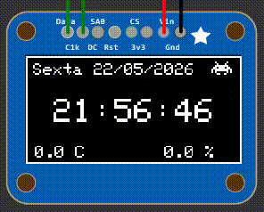
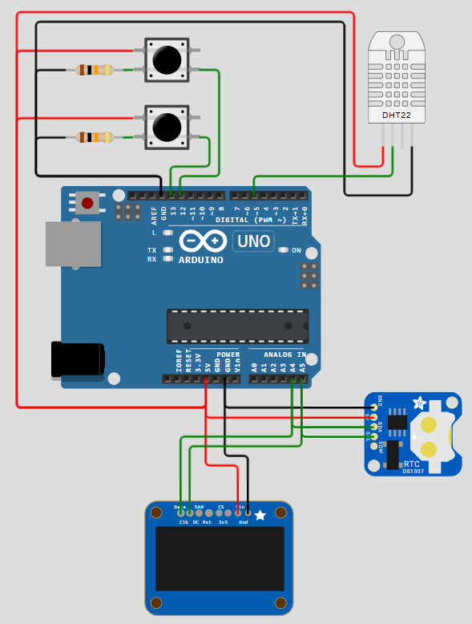
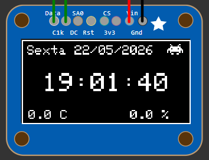
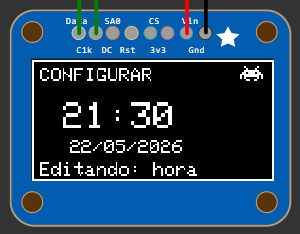

# Relógio Inteligente com OLED e RTC usando Arduino

Projeto de relógio digital com display OLED 128x64, RTC DS3231 e sensor DHT22, desenvolvido para exibição de hora, data, temperatura e umidade, incluindo interface de configuração utilizando apenas dois botões.

Projeto em equipe realizado em 2026.1 para disciplina de Projetos de Hardware e Software - USF.



## Features

- Display OLED 128x64 monocromático
- Relógio em tempo real utilizando RTC DS3231
- Exibição de:
  - Hora
  - Data
  - Dia da semana
  - Temperatura
  - Umidade
- Interface gráfica otimizada para OLED
- Sistema de estados (Normal / Configuração)
- Configuração de data e hora utilizando apenas dois botões
- Timeout automático no modo configuração
- Ícone bitmap customizado

## Arquitetura

O sistema foi dividido em dois estados principais:

- NORMAL
  - Responsável pela renderização da interface principal
  - Atualização periódica do relógio e sensores

- CONFIG
  - Responsável pela configuração da data e hora
  - Navegação por campos utilizando dois botões

### Diagrama de estados

[](https://mermaid.live/edit#pako:eNp1kdFKwzAUhl8lnEtpS5rars2FMCbKwG3gvJr1IraxKzZJOUuHOvo0PoovZtZtiuACCfnP-f5zQs4OClNK4LCxwsrrWlQolL9luSZuPV48Ed-_IvPF_Wx8l-tD9KCGxGQxv5neEk6WsupQIHk29uvTnMhj-g85bqzck4VQrTmPTXWBUkltHboVjcF_ah4fwslDraTp7HlgKZqtQPCgwroEbrGTHiiJSuwl7PbOHOzadcyBu2sp8DWHXPfO0wq9MkadbGi6ag38RTQbp7q2_P24nyhKXUqcmE5b4GGSDkWA7-ANeMRoQKOY0jRxR5jFiQfvjmJhkLGMMkrjMGNROOo9-Bj60iChcRxduh2zURoxD2RZW4Ozw-yGEfbfcxuG0A)

### Fluxo dos botões

[](https://mermaid.live/edit#pako:eNpFUs1y0zAQfpWdPbsZ_9Rp4wNM46RpGJJCwwnbB2EriQdbG9ZyabHzIlx74AF4hLwYsjopB2m0q-9Pmu0wp0JihNuKfuZ7wRq-zFKVqptkSvr0QnBg2TQlKVFQBhcX72DaraggELoV1XGATod2v75_WN187CFONnLXsoADMfhNlqrY0mbJXGkWDLKG-H59u1xk_8mvjR7m3WejCt-s9XurPreAefOjlVxQD7fJUuUsa6m0gEdREWdn0KxkWWqDWSSf-PT3qawJclEfyDotbIy77vS70m83g8edJW_KuodlshHVowmZk9qWwzNOf0yS7Axam6KHD0lMSpeqFZyhgzsuC4w0t9LBWnIthhK7VAGkqPcmaoqRORaCv6eYqqPhHIT6SlSfaUztbo_RVlSNqdpDIbSclWLHon7rslSF5JhapTHyxpdWBKMOnzAKfHfkBqHrXo_N5k3CsYPPBuV7o4k_cX3XDb2JH3hXRwd_WV93NHbDMLg0K_SvrgPfQVmYz-PV6zzYsTj-A9c6tSA)

## Estrutura do código

| Função | Responsabilidade |
|---|---|
| `rotinaNormal()` | Interface principal |
| `rotinaConfig()` | Controle do modo configuração |
| `verificaEntradaConfig()` | Detecta entrada no modo config |
| `incrementarCampo()` | Atualiza o valor do campo atual |
| `proximoCampo()` | Navega entre campos |
| `salvarConfig()` | Atualiza o RTC |
| `desenharTelaConfig()` | Renderiza a tela de configuração |

## Hardware

### Componentes utilizados

| Componente | Função |
|---|---|
| Arduino Uno/Nano | Controle principal |
| OLED SSD1306 128x64 | Interface gráfica |
| RTC DS3231 | Relógio em tempo real |
| DHT22 | Sensor de temperatura e umidade |
| 2 Push Buttons | Interface de configuração |

### Diagram de Hardware

[](https://mermaid.live/edit#pako:eNptkE9rwzAMxb-K0dkNmfPHqQ-DtSns0DEoPQ1fTO01Zo2VuTZsC_nuczPGCAx00Puhp4c0wgm1AQFnr4aO7A_SSffgdbQOyWp1T573u3ZJDsftErSPR8aWaINB4e76_g9trQea4qwGEXw0FHrje3WTMEpHiITQmd5IEKnVyr9JkG5KnkG5F8T-1-YxnjsQr-pyTSoOWgXTWpUO-RsxThu_xegCiPW8AcQIHyCqhmesbup8fVfmjPGCwieIkmdlwUteVTUrbjVR-Joj86zhFQWjbUD_9POy-XPTN1ryZIk)

### Esquema Eletrônico



## Bibliotecas utilizadas

- RTClib
- Adafruit_GFX
- Adafruit_SSD1306
- dht
- Wire

## Decisões de implementação

O sistema de configuração foi projetado para funcionar utilizando apenas dois botões, reduzindo a complexidade do hardware e mantendo acessibilidade.

Foi utilizado um modelo baseado em máquina de estados para simplificar a navegação entre os modos NORMAL e CONFIG.

## Possíveis melhorias futuras

- Ajuste individual de segundos
- Persistência adicional de configurações
- Alarmes
- Modo sleep para economia de energia
- Animações no display
- Indicador de tendência de temperatura/umidade
- Buzzer para feedback dos botões

## Funcionamento

### Estados Principais
O relógio terá dois estados:

- Normal: onde mostra e atualiza a hora.

- Configuracao: onde recebe inputs para configurar a hora.

Ele inicia no Normal e passa para o Configuracao se qualquer dos botões forem pressionados segurando por 2 segundos e retorna ao Normal quando não realiza uma ação por algum tempo (10 segundos).

#### Estado Normal

Fica se comunicando com os componentes (RTC e DHT22) e atualizando a tela.

Passa para o estado Configuracao se qualquer dos botões forem pressionados segurando por 2 segundos.



#### Estado Configuracao

Permite configurar o horário do RTC utilizando os botões.

Inicia uma variável que verifica o timeout do usuário (tempo sem input do usuário).

Se o timeout chega a 10 segundos, retorno o estado do relógio para Normal.

Campos configuráveis:
````
HORA -> MINUTO -> DIA -> MES -> ANO -> SALVAR
````

Circularidade dos campos configuráveis:
````
hora: 0..23
minuto: 0..59
dia: 1..31
mes: 1..12
ano: 2024..2035
diaSemana: 0..6
````

 
